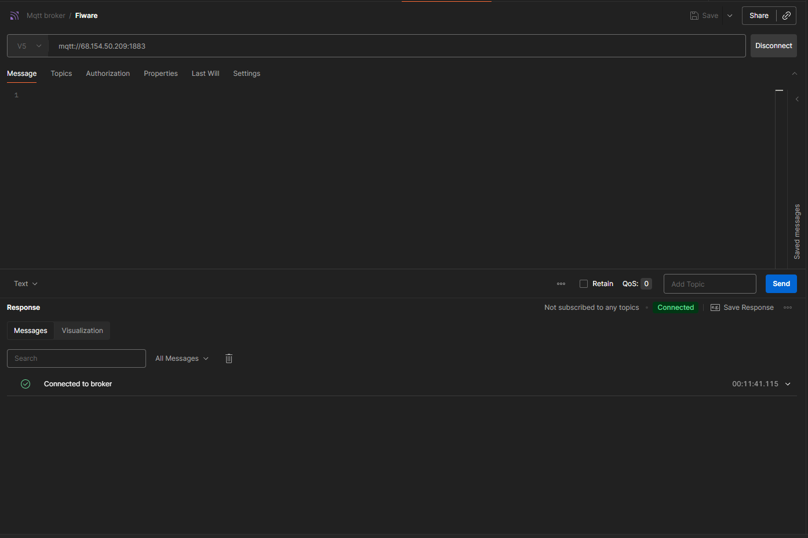
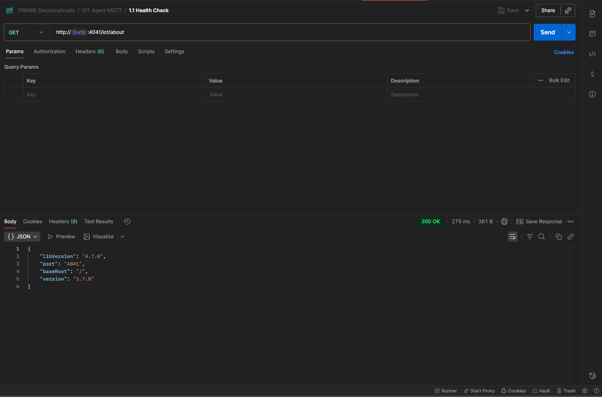
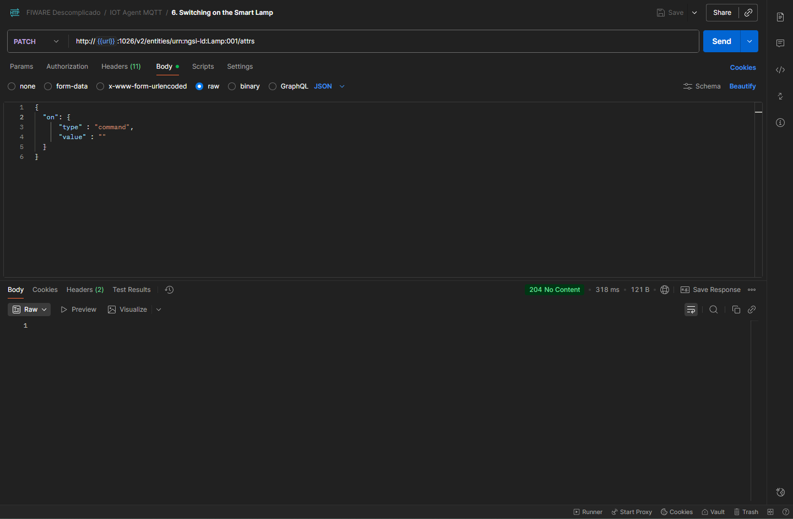

# CP5-EdgeComputing

## Importante destacar o uso de um IP próprio, feito na Azure com a ajuda do Fiware
# Link do projeto
https://wokwi.com/projects/445465032852274177

## Broker mosquitto em pleno funcionamento

  

## Health Check em dia, mostrando assim o uso do Fiware

  

## Toggle funcionando
### Como não temos como mostrar, apenas passe o parâmetro "on" ou "off" no body do método Patch para ver a luz alternando seu estado

  

# Participantes
- João Victor Rodrigues de Mattos RM:564249
- Paulo Henrique Barboza de Oliveira Ramos RM:562179
- Enzo Amá Fatobene RM:562138
- Leonardo Borges da Costa RM: 565966
- Pedro Henrique Araujo de Abreu RM: 561924
